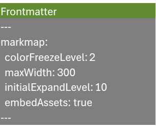
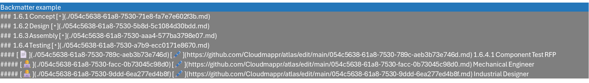
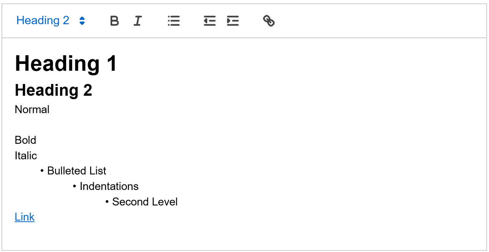

# Atlas Proofs of Concept

## [Markmap](https://github.com/markmap/markmap)
Typescript mindmap renderer available under MIT license, leveraging YAML-like markup for structure

### Example markup

### Output
All simulations have guids; only Bicycle Simulator has sample backend data

- Bicycle Project Test: Semi-functional demo for project quoting
  - [WBS](https://cloudmappr.github.io/atlas/bicycleDemo_WBS)
  - [Mindmap](https://cloudmappr.github.io/atlas/bicycleDemo_MM)
- Space System:  System of System structure for MIL-STD-811F Appendix J Space System with over 400 elements
  - [WBS](https://cloudmappr.github.io/atlas/spaceSystem_WBS)
  - [Mindmap](https://cloudmappr.github.io/atlas/spaceSystem_MM)
- Web Design:  Typical web design work breakdown structure
  - [WBS](https://cloudmappr.github.io/atlas/webDesign_WBS)
  - [Mindmap](https://cloudmappr.github.io/atlas/webDesign_MM)
- Curriculum:  Syllabus for a freshman-level ancient history course
  - [Mindmap](https://cloudmappr.github.io/atlas/ancientHistory_Curr)
- Learning Path: 
  - Mindmap
  
### In Context
