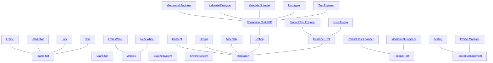

```mermaid
flowchart BT
1[<a href='./054c5639-0c33-7531-24f8-185499254b2a'>Frame Set</a>] --- 2[<a href='./054c5639-973d-7531-66c5-55dc19a0b088'>Frame</a>]
1[<a href='./054c5639-0c33-7531-24f8-185499254b2a'>Frame Set</a>] --- 3[<a href='./054c5639-c2dd-7531-fb02-228a9afebb6a'>Handlebar</a>]
1[<a href='./054c5639-0c33-7531-24f8-185499254b2a'>Frame Set</a>] --- 4[<a href='./054c5639-f98e-7531-997e-0810a51b44c7'>Fork</a>]
1[<a href='./054c5639-0c33-7531-24f8-185499254b2a'>Frame Set</a>] --- 5[<a href='./054c5639-8763-7531-90c8-199cd08f5b38'>Seat</a>]
6[<a href='./054c5639-2fe8-7531-fa32-959f55c25526'>Crank Set</a>]
7[<a href='./054c5639-9636-7531-56ba-7a3c8883f852'>Wheels</a>] --- 8[<a href='./054c5639-c491-7531-f5b9-ce482b5d5751'>Front Wheel</a>]
7[<a href='./054c5639-9636-7531-56ba-7a3c8883f852'>Wheels</a>] --- 9[<a href='./054c5639-3dbb-7531-9d6d-c50aac53c556'>Rear Wheel</a>]
10[<a href='./054c5639-c2d6-7531-a160-b392b2e4be48'>Braking System</a>]
11[<a href='./054c5639-feff-7531-9a3c-cf9bc496ffc4'>Shifting System</a>]
12[<a href='./054c5639-7ad6-7531-58ae-dc20e8288f89'>Integration</a>] --- 13[<a href='./054c5639-0da3-7531-3675-e15587c1512b'>Concept</a>]
12[<a href='./054c5639-7ad6-7531-58ae-dc20e8288f89'>Integration</a>] --- 14[<a href='./054c5639-e004-7531-3c07-b7e8fe537de5'>Design</a>]
12[<a href='./054c5639-7ad6-7531-58ae-dc20e8288f89'>Integration</a>] --- 15[<a href='./054c5639-f3c9-7531-bf32-d836bc17f758'>Assembly</a>]
12[<a href='./054c5639-7ad6-7531-58ae-dc20e8288f89'>Integration</a>] --- 16[<a href='./054c5639-1326-7531-dcd7-79f80aa90bff'>Testing</a>]
16[<a href='./054c5639-1326-7531-dcd7-79f80aa90bff'>Testing</a>] --- 17[<a href='./054c5638-61a8-7530-789c-aeb3b73e746d'>Component Test RFP</a>]
17[<a href='./054c5638-61a8-7530-789c-aeb3b73e746d'>Component Test RFP</a>] --- 18[<a href='./054c5638-61a8-7530-a1f0-5d6b6e4758f6'>Mechanical Engineer</a>]
17[<a href='./054c5638-61a8-7530-789c-aeb3b73e746d'>Component Test RFP</a>] --- 20[<a href='./054c5638-61a8-7530-9ddd-6ea277ed4b8f'>Industrial Designer</a>]
17[<a href='./054c5638-61a8-7530-789c-aeb3b73e746d'>Component Test RFP</a>] --- 21[<a href='./054c5638-61a8-7530-6b9c-183fd307381a'>Materials Scientist</a>]
17[<a href='./054c5638-61a8-7530-789c-aeb3b73e746d'>Component Test RFP</a>] --- 24[<a href='./054c5638-61a8-7530-5605-91e074795695'>Prototypes</a>]
17[<a href='./054c5638-61a8-7530-789c-aeb3b73e746d'>Component Test RFP</a>] --- 27[<a href='./054c5638-61a8-7530-71a1-e16e1d33e02e'>Test Engineer</a>]
30[<a href='./054c5639-edea-7531-35c3-1a3501429191'>Product Test</a>] --- 31[<a href='./054c5638-61a8-7530-0ac9-e573e4a859bf'>Product Test Engineer</a>]
30[<a href='./054c5639-edea-7531-35c3-1a3501429191'>Product Test</a>] --- 32[<a href='./054c5638-61a8-7530-a1f0-5d6b6e4758f6'>Mechanical Engineer</a>]
12[<a href='./054c5639-7ad6-7531-58ae-dc20e8288f89'>Integration</a>] --- 33[<a href='./054c5639-79d2-7531-aeca-2e9b5da89893'>Customer Test</a>]
33[<a href='./054c5639-79d2-7531-aeca-2e9b5da89893'>Customer Test</a>] --- 34[<a href='./054c5638-61a8-7530-0ac9-e573e4a859bf'>Product Test Engineer</a>]
33[<a href='./054c5639-79d2-7531-aeca-2e9b5da89893'>Customer Test</a>] --- 35[<a href='./054c5638-61a8-7530-c108-89807573af1f'>User Testing</a>]
36[<a href='./054c5638-61a8-7530-df34-e70549dc88d6'>Project Management</a>] --- 37[<a href='./054c5639-7043-7531-0399-15c8d9997c62'>Testing</a>]
36[<a href='./054c5638-61a8-7530-df34-e70549dc88d6'>Project Management</a>] --- 38[<a href='./054c5638-61a8-7530-42d5-25e393787a37'>Project Manager</a>]
```