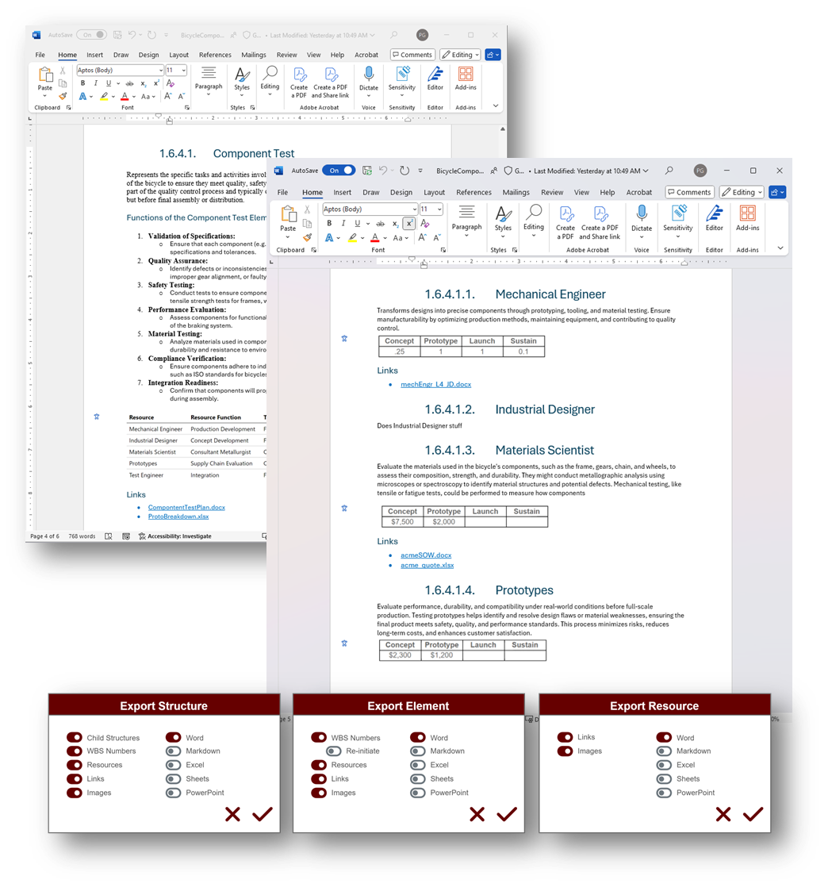

# Introducing Atlas
Copyright Notice

© 2024 Paul Galjan. All rights reserved. This project and its contents, including any designs, specifications, and associated materials, are protected by copyright law. Unauthorized use, reproduction, or distribution of this document or any part of its contents is prohibited without the express written permission of Paul Galjan.

Legal Use and Restrictions

This document is intended solely for personal use and may not be shared, reproduced, or modified without prior written consent. Violators may be subject to legal action.

## Overview & Use Cases
Atlas is a conceptual structure visualization and annotation platform featuring a modular interactive renderer that allows the user to create or calculate multiple structured or unstructured views of their data.  These views can be shared with others, and the same data may be represented in different views while maintaining consistency.

The front-end is paired with a simple, flexible and scalable multi-user key/value store for user annotation of the data, along with subsequent reporting.

The same data set can be leveraged in multiple structures, leaving the user free to create multiple structures of the same library, allowing visual and quantitative comparison based on the relationships defined by the user in the renderer.

<table border="0">
 <tr>
    <td> 
     
    </td>
    <td>
    
- **Strategy teams** can collaborate to quickly generate, iterate, assess, and compare business plan and proposal assets.  

- **Analysts** can construct reports across structures for comparative and historical analysis.  

- **Generative AI Consumers** can structure GenAI output for human curation, research, and annotation

- **Instructors** can distribute syllabus and other assets, and gather assets from **learners**, who can leverage it for structured notetaking aligning to a syllabus or learning plan, or independent learning
  
- **Content Managers** can construct multiple views and hierarchies of content to provide persona-aligned navigation experiences

- Buy-side **planners** can collect and report on assets from vendors, suppliers and distributors.  

- **UX designers** can quickly re-imagine legacy records and navigation experiences, using the Atlas backend to combine and enrich data from multiple sources.  

- **Consultants** can create flexible, semi-structured data sets and no-code UIs for comparative analysis.</td>
 </tr>
</table>

## Proof of concept<!-- markmap: foldAll -->
The PoC is built on, but not dependent on, [Markmap](https://github.com/markmap/markmap) (MIT License), a typescript mindmap renderer leveraging YAML-like markup for structure, resulting in simple. human-readable backmatter.  It is tolerant of raw markdown, with intelligent parsing of headers and bullets while ignoring tables and base text, along with support for CSS.  Support for initial fold status at the node level allows for primitive zoom-to based on search parameters, and it has built in navigation controls, so it's an ideal candidate for initial exploration of the concept. While Markmap does not render unstructured datasets, the backend data can be rendered by alternative renderers.

The backend is logically separated from the renderer, maintaining UUIDs and annotated, so markmap can and will co-exist and interoperate with alternative renderers such as [drawio](https://github.com/jgraph/drawio) (Apache License) or [mermaid](https://github.com/mermaid-js/mermaid) (MIT License) to address tree, workflow, state , gannt, network, and C4 diagrams, as well as arbitrary (canvas) structures.   

### Markmap
<table border="0">
 <tr>
    <td> 
     
    </td>
    <td>
     
 </tr>
</table>

### Simulations
All simulations have randomized excel-generated guids, which are more or less reliable for test purposes but clearly not RFC9562 compliant.

#### **Bicycle Component Test Bid**: Semi-functional project quoting demo with sample backend data and simulated iconography

<table border="0">
 <tr>
    <td> 
<iframe
  src="./bicycleDemo_WBS.html"
  style="width:800px; height:400px;"
></iframe>
    </td>
    <td>
<iframe
  src="./054c5638-61a8-7530-789c-aeb3b73e746d.html"
  style="width:650px; height:400px; font-size:8px;"
></iframe>
 </tr>
</table>

#### Other structures
-  [**Space System**](./spacedemo.html):  System of System structure for [MIL-STD-811F Appendix J Space System](https://quicksearch.dla.mil/qsDocDetails.aspx?ident_number=36026) with over 400 elements

- [**Product breakdown**](./computerpbs.html): PBS for a typical laptop computer 

- [**Human Body**](./humanbody.html):  Taxonomy for human anatomy
  
- [**Web Design**](./webDesign_WBS.html):  Typical web design work breakdown structure

- [**Human brain**](./humanbrain.html): Taxonomy of the human brain

- [**Sensor Package**](./autonomousVehicle.html):  Notional sensing and control package for autonomous systems

- [**Curriculum**](./ancientHistory_Curr.html):  Syllabus for a freshman-level ancient history course

- [**Languages**](./humanlanguages.html): Human Language Taxonomy

- [**Learning Path**](./learningPath.html): Example learning path

### Mock Data Set
Mock data for these and a variety of structures are provided in the atlas [kickstarter](./AtlasKickstarter.xlsx)

- **uatDataSet**:  User acceptance data - the platform is expected to calculate the numerically accurate structure for each named dataset, along with an [RFC9562](https://datatracker.ietf.org/doc/html/rfc9562)-compliant **version 4** UUID for each record, populating the results into an appropriate persistent data store to generate backmatter and allow the user to enrich the data.

- **wbs2markmap**: Allows users to create their own numerically accurate structures with guids, customize the base url and iconography.

- **markmap2wbs**:   Converts hash-annotated markmap into a numerically accurate structure with guids.
  
- **import**: future use for import into the Atlas platform

### In Context
<table border="0">
 <tr>
    <td> 
    <a href="./img/image-4.png">Structure Display, Attributes, Summary nav</a>
     
    </td>
    <td>
    <a href="./img/image-9.png">Structure Export</a>
     
   </td>
 </tr>
 <tr>
    <td> 
    <a href="./img/image-5.png">Structure Inventory</a>
     
    </td>
    <td>
    <a href="./img/image-7.png">Learning Path Use Case</a>
     
   </td>
 </tr>
 <tr>
    <td> 
    <a href="./img/image-10.png">Cross-Structure Reporting</a>
        </td>
    <td>
    <a href="./img/image-8.png">Example Structure-level Attributes</a>
     
   </td>
 </tr>

</table>

## Phase 1
### Components
- markmap (or similar) renderer
- stackedit (or similar) markdown editor
- sqlite (or similar) backend
- Python/Flask (or similar) frontend/business logic

### Functionality

- Structure Map
  - Zoom to node on search
  - Child node CRUD
    - Toggle Child node deletion (re-parent by default)
  - Document CRUD (Instantiate on click)
  - Filter map by level
  - Toggle WBS numbering

- Structure Actions
  - Export 
    - consolidated, hierarchical docx, pdf, md, and html
    - Toggle WBS numbering
  - Backup (zip)
    - manifest
    - csv exports
    - db dump
    - estimate size on export
  - Restore
    - import db dump
  - Append Structure (element level)
    - Import from AtlasKickstarter excel template

### Mockup
