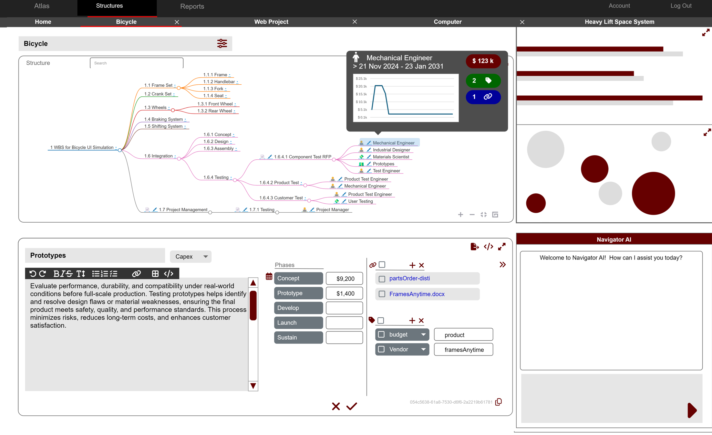
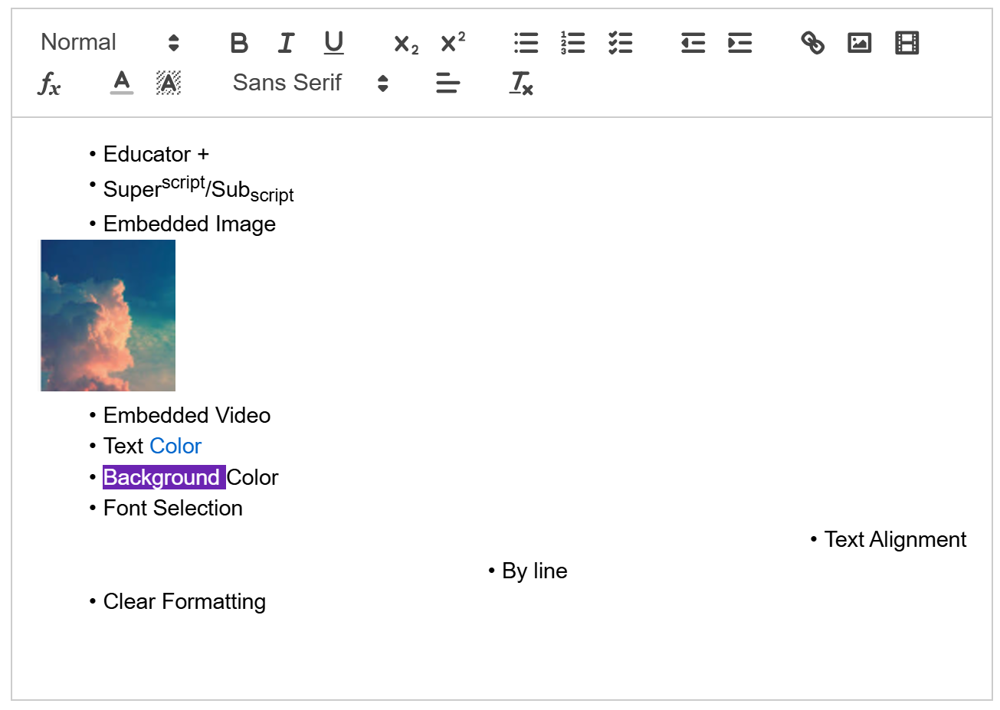
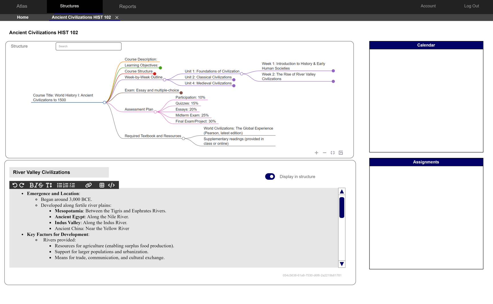
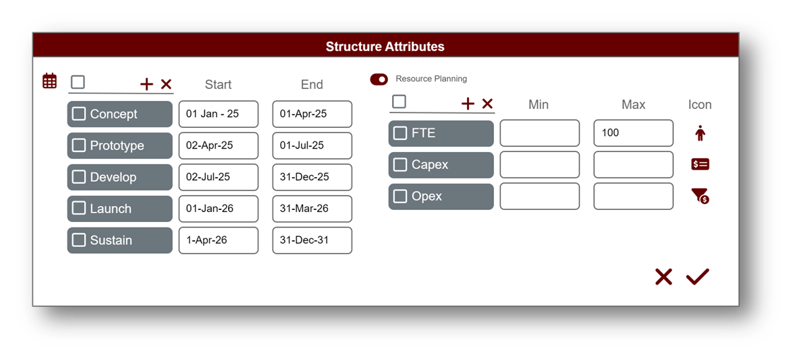
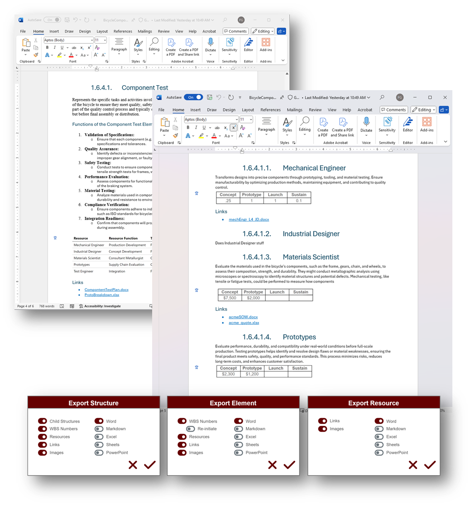
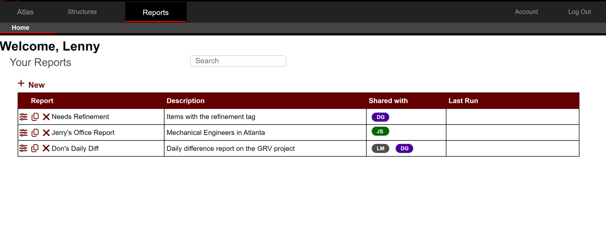

# Introducing Atlas
Copyright Notice
 

© 2024 Paul Galjan. All rights reserved. This project and its contents, including any designs, specifications, and associated materials, are protected by copyright law. Unauthorized use, reproduction, or distribution of this document or any part of its contents is prohibited without the express written permission of Paul Galjan.

Legal Use and Restrictions

This document is intended solely for personal use and may not be shared, reproduced, or modified without prior written consent. Violators may be subject to legal action.

## Overview & Use Cases
Atlas is a conceptual structure visualization and annotation platform featuring a modular interactive renderer that allows the user to create or calculate multiple structured or unstructured views of their data.  These views can be shared with others, and the same data may be represented in different views while maintaining consistency.

The front-end is paired with a simple, flexible and scalable multi-user key/value store for user annotation of the data, along with subsequent reporting.

<iframe
  src="https://cloudmappr.github.io/atlas/atlasintro.html"
  style="width:100%; height:400px;"
></iframe>

### **Strategy teams** can use the platform to quickly generate, iterate, assess, and compare business plan and proposal assets.  
### **Analysts** can construct reports across structures for comparative and historical analysis.  
### **Generative AI Consumers** can use Atlas to structure GenAI output for human curation, research, and annotation
### **Instructors** can leverage it for syllabus and asset distribution as well as student assignment collection, with a robust backend for snapshotting and timestamping. 
### **Students** can leverage it for structured notetaking aligning to a syllabus or learning plan.  
### Buy-side **planners** can leverage Atlas to collect assets from endors, suppliers and distributors.  
### **UX designers** can leverage the platform to overhaul the user experience for legacy records interfaces interfaces, and it the Atlas backend to integrate and enrich data from multiple sources.  
### **Consultants** can leverage Atlas to create flexible, semi-structured data sets for comparative analysis.

## Proof of concept<!-- markmap: foldAll -->
The PoC is built on, but not dependent on, [Markmap](https://github.com/markmap/markmap) (MIT License), a typescript mindmap renderer leveraging YAML-like markup for structure, resulting in simple. human-readable backmatter.  It is tolerant of raw markdown, with intelligent parsing of headers and bullets while ignoring tables and base text, along with support for CSS, and allows for initial fold status at the node level, so it's an ideal candidate for initial exploration of the concept.  Markmap does not render unstructured datasets or hierarchies deeper than six.

The backend is logically separated from the renderer, maintaining UUIDs and annotated, so markmap can and will co-exist and interoperate with alternative renderers such as [drawio](https://github.com/jgraph/drawio) (Apache License) or [mermaid](https://github.com/mermaid-js/mermaid) (MIT License) to address canvas-style, tree-style, workflow, state diagram, ganntt, C4, and deep structure use cases.   The same data set can be leveraged in multiple structures, so user could define their own hierarchies or canvases, save and switch between them without impacting the state and content of the objects.

### Markmap
#### Example Frontmatter

#### Example backmatter

### Simulations
All simulations have excel-generated guids, which are reliable for test purposes but not RFC9562 compliant.

<iframe
  src="https://cloudmappr.github.io/atlas/bicycleDemo_WBS.html"
  style="width:100%; height:400px;"
></iframe>

#### **Bicycle Project Test**: Semi-functional project quoting demo with sample backend data and simulated iconography

<iframe
  src="https://cloudmappr.github.io/atlas/spacedemo.html"
  style="width:100%; height:400px;"
></iframe>

#### **Space System**:  System of System structure for [MIL-STD-811F Appendix J Space System](https://quicksearch.dla.mil/qsDocDetails.aspx?ident_number=36026) with over 400 elements

<iframe
  src="https://cloudmappr.github.io/atlas/webDesign_WBS"
  style="width:100%; height:400px;"
></iframe>

#### **Web Design**:  Typical web design work breakdown structure

<iframe
  src="https://cloudmappr.github.io/atlas/ancientHistory_Curr"
  style="width:100%; height:400px;"
></iframe>

#### **Curriculum**:  Syllabus for a freshman-level ancient history course

<iframe
  src="https://cloudmappr.github.io/atlas/humanlanguages"
  style="width:100%; height:400px;"
></iframe>

#### **Languages**: Human Language Taxonomy

<iframe
  src="https://cloudmappr.github.io/atlas/learningPath"
  style="width:100%; height:400px;"
></iframe>

#### **Learning Path**: Example learning path

### Mock Data Set
Mock data for these and a variety of structures are provided in the atlas [template](https://view.officeapps.live.com/op/view.aspx?src=https%3A%2F%2Fcloudmappr.github.io%2Fatlas%2Ftemplate.xlsx&wdOrigin=BROWSELINK)

##### Excel copy-pastable
<iframe
  src="https://view.officeapps.live.com/op/view.aspx?src=https%3A%2F%2Fcloudmappr.github.io%2Fatlas%2Ftemplate.xlsx&wdOrigin=BROWSELINK"
  style="width:100%; height:800px;"
></iframe>

####  **uatDataSet**:  User acceptance data - the platform is expected to calculate the numerically accurate structure for each named dataset, along with an [RFC9562](https://datatracker.ietf.org/doc/html/rfc9562)-compliant UUID for each record, populating the results into an appropriate persistent data store to generate backmatter and allow the user to enrich the data.

####  **wbs2markmap**: Allows users to create their own numerically accurate structures with guids, customize the base url and iconography.

####  **markmap2wbs**:   Converts hash-annotated markmap into a numerically accurate structure with guids.

### In Context
#### [Structure Display, Attributes, Summary nav](image-4.png)

#### [Resource Attributes, Summary](image-6.png)
 
#### [Structure Inventory](image-5.png)
 
#### [Learning Path use case](image-7.png) 

#### [Structure-level attributes](image-8.png)

#### [Export](image-9.png)

#### [Cross-structure reporting](image-10.png)
